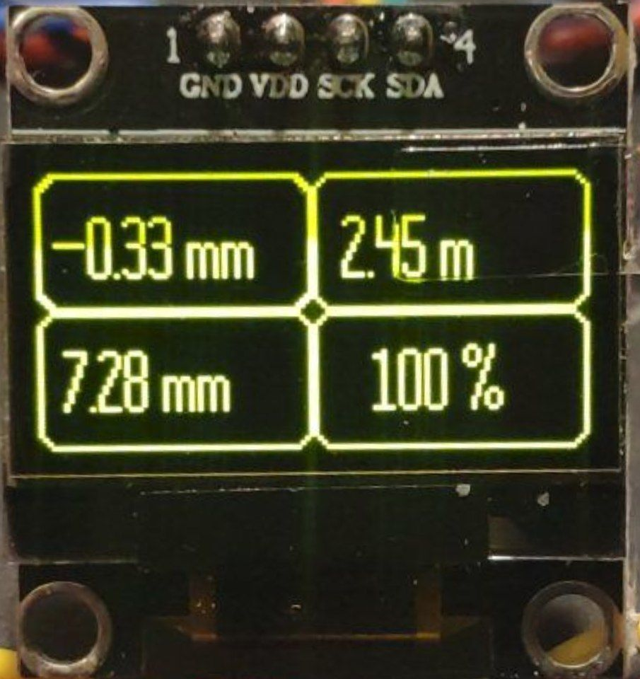
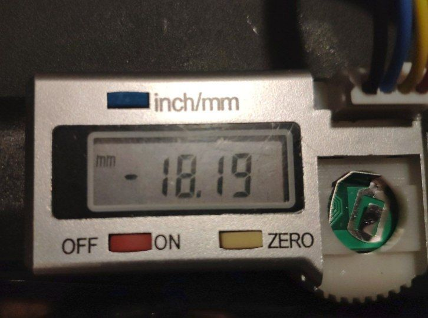
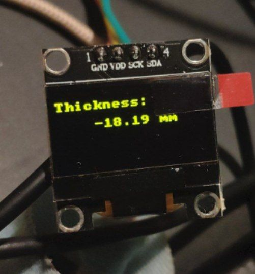
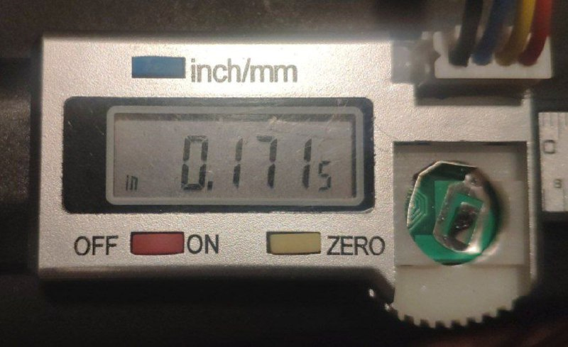
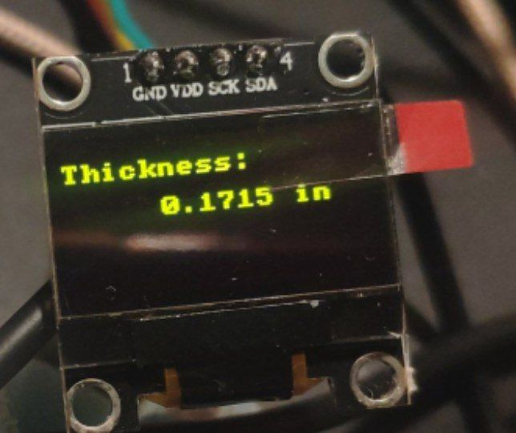

### The Original project (Smart Bottle Cutter)
* [Проект "Умный бутылкорез"](https://www.youtube.com/watch?v=465i-q0ZXCA) Arduino Nano
  * [Project files](https://disk.yandex.ru/d/M581IImOExM3jw)
* [UPgrade умного бутылкореза. UPgrade smart bottle cutter.](https://www.youtube.com/watch?v=ZA6ZmTGsUik) Arduino Nano
  * [Project files (the same as previous)](https://disk.yandex.ru/d/M581IImOExM3jw)
* [SBC and Pull прошивка.](https://www.youtube.com/watch?v=5JAZ4eqUPCo) ESP32
  * [Project files](https://disk.yandex.ru/d/q4G4xkjaZWwRnA)
* [Бутылкорез из подшипников, регулируемый (от Александра).](https://www.youtube.com/watch?v=owXAROaGVHI)
  * [Project fies](https://drive.google.com%2Fdrive%2Ffolders%2F17S7W58JXxoeaXaPE_QbjwrEQ2xE5hOtx%3Fusp%3Dsharing&v=owXAROaGVHI)
  * [Project files (mirror)](https://disk.yandex.ru%2Fd%2Fr-sMay45b0uj8Q&v=owXAROaGVHI)
* [Бутылкорез от Александра V2](https://www.youtube.com/watch?v=5Byc4Kf1D5c)

### SBCCtl (Smart Bottle Cutter Controller)
This will be alternative electroics for Smart Bottle Cutter.

**The project is on the early development.**

#### General
As Mechanics I use bottle cutter from [Alexander](https://www.youtube.com/watch?v=5Byc4Kf1D5c) (reference below)

To measure stripe length I develop [DIY encoder](https://www.thingiverse.com/thing:5988577)

To read data from guage use [Level Shifter](https://github.com/mvbasov/SBCCtl/wiki/LevelShifter)

See [WiKi](https://github.com/mvbasov/SBCCtl/wiki) for usefull information

ssd1306 library from [here](https://github.com/nopnop2002/esp-idf-ssd1306)

#### This time implemented
- Reading data from calipers
- Reading data from stripe length [sensor](https://www.thingiverse.com/thing:5988577)
- Draft for set stripe width algorithm

##### UI (early development)

##### Reading data from calipers

